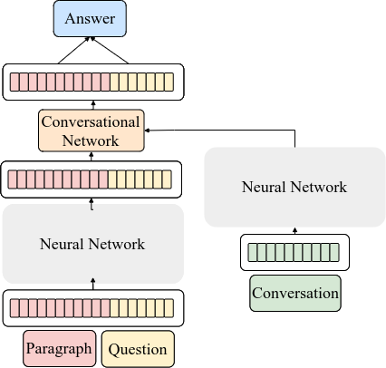

## __Hypernetwork for History Function__

Here is the implementation of the Hypernetwork for History Function. We utilize hypernetwork to generate parameter for storing conversation imformation. Then, through elementwise multiplication, parameter will fuse information into input to integrate conversation information and do the conversational questoin answering task. Also, we implement another four baseline methods to do a fair comparison in three conversational question answering datasets.

<p align="center">
  
</p>

## Dependencies

- Python 3.7.3
- Computing power (high-end GPU) and memory space (both RAM/GPU's RAM) is **extremely important** if you'd like to train your own model.
- Required packages and their use are listed [requirements.txt](requirements.txt).


## __Structure__

The project structure need to be initialized like below.

```
|--main_project
    |--Model_storage
        |--Model 1 you have saved
        |--Model 2 you have saved
        |-- ...
    |--dataset_local
        |--CoQA
            |--coqa-dev-v1.0.json
            |--coqa-train-v1.0.json
            |-- ...
        |--QuAC
            |--train.json
            |--dev.json
            |-- ...
        |--DoQA
        |--dataset_you_want
        |-- ...
    |--preprocessing_files
        |--CoQA
        |--DoQA
        |--QuAC
        |--dataset_you_want
        |-- ...
    |--Response-writer
        |--bert-official-config-eval
            |-- ...
            ...
        |--bert-official-config-train
            |-- ...
            ...
        |-- ...
        ...
        different_decoding_coqa.py
        different_decoding_doqa.py
        different_decoding_quac.py
        ...
        model.png
        Readme.md
        requirement.txt
        ...
```

In the following tutorial, we will tell you how to run code on QuAC dataset.
## __Stage 0: Prepare data__

In Stage 0, you need to download json file of dataset and store in the dataset_local folder. (For example: dataset_local/QuAC/train.json and dataset_local/QuAC/dev.json)

## __Stage 1: Data Preprocessing__

In Stage 1, We have had json file, so we need to do preprocessing and store feature to do conversational question answering.
The preprocessing code is in `Response-writer/extract_feature/extract_feature_bert_quac_truncated.py`. The preprocessing config is in `Response-writer/preprocessing_configs/bert/QuAC/base_train_truncated_HAE.yaml`

## __Stage 2:Train Model__

In Stage 2, You can train your model by finishing training config.

